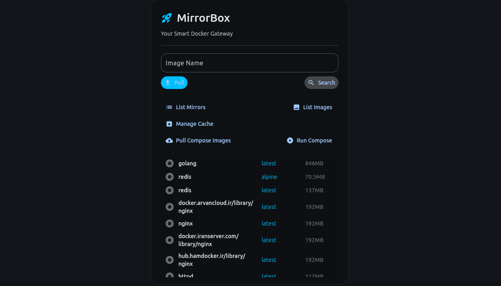

# MirrorBox v1.0 🚀

**A smart, caching proxy for Docker, designed to bypass registry restrictions and accelerate your image pulls.**

MirrorBox is a modern command-line tool (with a full GUI!) that acts as a smart gateway for Docker. It intelligently routes your Docker image requests through the fastest available mirrors, caches images locally for offline access, and seamlessly integrates with your development workflow.

---

## 📦 Installation & Quick Start

MirrorBox requires **Python 3.10+**. After installing, the first command you should run is `start`.

```bash
# Recommended installation via pipx for CLI tools
pipx install mirrorbox

# Or install with standard pip
pip install mirrorbox
```

Once installed, get a full tour of the commands:
```bash
mirrorbox start
```

---

## ✨ New in v1.0: The Graphical User Interface!

For a more visual and user-friendly experience, you can now launch the MirrorBox desktop application.

Simply run:
```bash
mirrorbox open
```

The GUI allows you to manage all key features of MirrorBox from a beautiful and modern interface.



---

## 🛠️ All Commands

Below is a detailed guide to all available commands.

### **1. Basic Mirror & Image Commands**

-   **Check Mirror Status:** `mirrorbox list-mirrors`
-   **Search for an Image:** `mirrorbox search nginx:latest`
-   **Pull an Image (Smart Pull):** `mirrorbox pull ubuntu:22.04`
-   **List Local Docker Images:** `mirrorbox list-images`

### **2. Docker Compose Integration**

-   **Pull and Run Compose Project:** `mirrorbox compose up -d --build`

### **3. Cache Management**

-   **List Cached Images:** `mirrorbox cache list`
-   **Save an Image to Cache:** `mirrorbox cache save httpd:latest`
-   **Remove Cached Images:** `mirrorbox cache remove httpd-latest.tar`

### **4. Configuration**

-   **View Current Settings:** `mirrorbox config show`
-   **Set a Priority Mirror:** `mirrorbox config set-priority focker.ir`
-   **Unset Priority Mirror:** `mirrorbox config unset-priority`

### **5. Monitoring & Reporting**

-   **Show History Report:** `mirrorbox report show --limit 15`
-   **Launch Live Dashboard:** `mirrorbox monitor start --interval 5`

---

## 📄 License

Copyright (c) 2025 Pouya Rezapour. See the `LICENSE` file for more details.